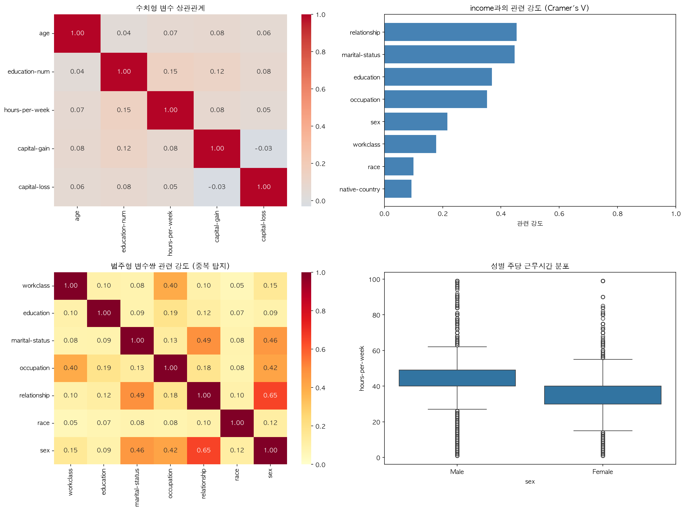
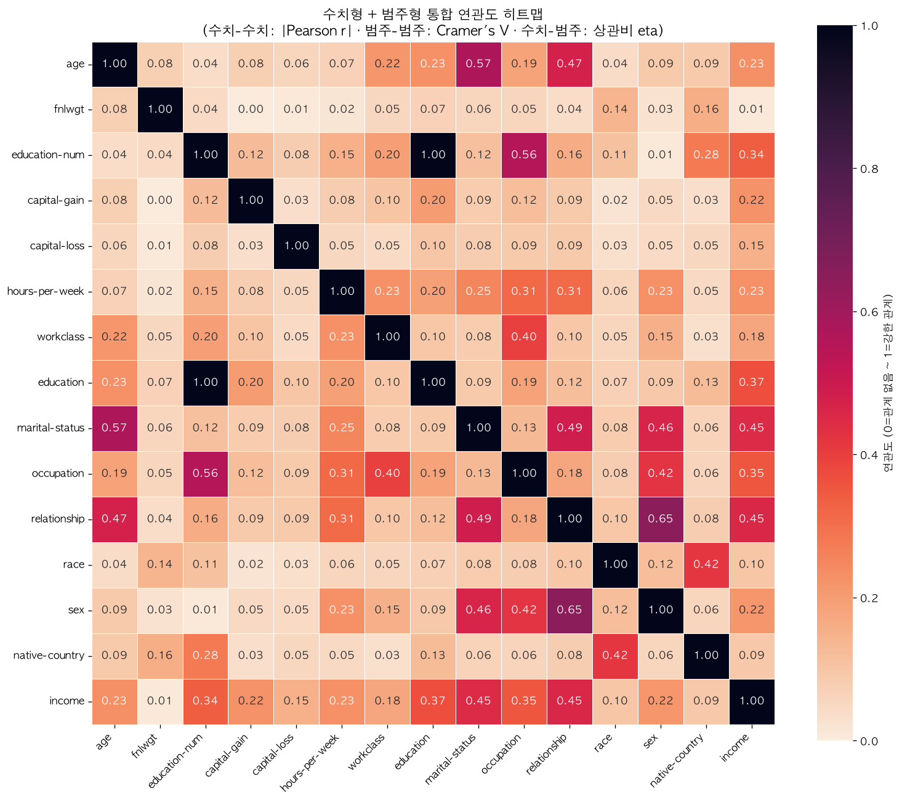

# Adult Census Income End-to-End 데이터 분석 보고서

## 1. 프로젝트 개요

- 과정: SKALA AI의 서비스화 - 데이터 분석 및 AIOps
- 데이터셋: UCI Adult Census Income
- 목표: Pandas와 Polars 기반 EDA, 통계 검정, 시각화, ML Pipeline을 하나의 실행 흐름으로 자동화한다.
- 분석 대상: 중복과 국적 결측치를 제거한 31,955행, 15개 원본 변수
- 타깃: `income` (`<=50K`, `>50K`)

## 2. 데이터 준비 및 품질 처리

| 처리 항목 | 결과 |
|---|---:|
| 원본 데이터 | 32,561행 |
| 중복 제거 | 24행 |
| `native-country` 결측 또는 `?` 제거 | 582행 |
| 최종 분석 데이터 | 31,955행 |
| `<=50K` | 24,262행 |
| `>50K` | 7,693행 |

Pandas에서는 데이터 정제, 기술통계, 상관계수와 모델 입력 구성을 수행했다. Polars에서는 동일한 정제 데이터를 변환하여 결측치, 수치형 기술통계, 소득 그룹별 평균 나이와 평균 근무시간을 집계했다.

## 3. 탐색적 데이터 분석(EDA)

### 3.1 수치형 기술통계

| 변수 | 평균 | 표준편차 | 최솟값 | 중앙값 | 최댓값 |
|---|---:|---:|---:|---:|---:|
| age | 38.58 | 13.66 | 17.00 | 37.00 | 90.00 |
| fnlwgt | 189,715.21 | 105,730.91 | 12,285.00 | 178,309.00 | 1,484,705.00 |
| education-num | 10.07 | 2.56 | 1.00 | 10.00 | 16.00 |
| capital-gain | 1,065.13 | 7,301.17 | 0.00 | 0.00 | 99,999.00 |
| capital-loss | 86.80 | 401.73 | 0.00 | 0.00 | 4,356.00 |
| hours-per-week | 40.42 | 12.34 | 1.00 | 40.00 | 99.00 |

### 3.2 주요 수치형 상관관계

| 변수 1 | 변수 2 | 절대 상관계수 |
|---|---|---:|
| education-num | hours-per-week | 0.150 |
| education-num | capital-gain | 0.123 |
| education-num | capital-loss | 0.081 |
| capital-gain | hours-per-week | 0.079 |
| age | capital-gain | 0.077 |

전체 수치형 상관행렬은 프로그램 실행 중 콘솔에 출력하며, 정적 히트맵에도 함께 표현한다.

## 4. 시각화 결과

### 4.1 Seaborn 정적 시각화

- 수치형 변수 상관관계
- 범주형 변수와 소득의 Cramer's V
- 범주형 변수쌍 관련 강도
- 성별 주당 근무시간 분포

### 4.2 Plotly 인터랙티브 시각화

- [fnlwgt와 고소득 비율](income_fnlwgt_analysis.html)
- [소득 분류 혼동행렬](classification_report.html)

두 HTML 파일은 확대, 축소, 마우스 오버를 지원한다. 모든 차트에 제목과 축 레이블을 지정했다.

## 5. 통계 분석

### 5.1 가설

- 귀무가설: `<=50K`와 `>50K` 집단의 평균 `fnlwgt`는 같다.
- 대립가설: 두 집단의 평균 `fnlwgt`는 다르다.
- 유의수준: 0.05

### 5.2 Welch t-test 결과

| 항목 | 결과 |
|---|---:|
| `<=50K` 평균 | 190,253.83 |
| `>50K` 평균 | 188,016.54 |
| t 통계량 | 1.6483 |
| p-value | 0.0993158 |
| 점이연 상관계수 | -0.0090 |

p-value와 유의수준 0.05를 비교한 결과, 두 소득 집단의 `fnlwgt` 평균에는 통계적으로 유의한 차이를 확인하지 못했다. 통계적 유의성과 실제 영향력은 다르므로 점이연 상관계수의 크기도 함께 고려해야 한다.

## 6. 머신러닝 Pipeline

범주형 변수에는 최빈값 대치와 One-Hot Encoding을, 수치형 변수에는 중앙값 대치와 StandardScaler를 적용했다. 이 전처리를 Logistic Regression 또는 Random Forest 분류기와 하나의 `Pipeline`으로 결합하고 GridSearchCV로 비교했다.

| 평가 항목 | 결과 |
|---|---:|
| 최고 교차검증 F1 | 0.6981 |
| 테스트 정확도 | 0.8216 |
| 테스트 F1 (`>50K`) | 0.6907 |
| 최적 파라미터 | `{'classifier': RandomForestClassifier(class_weight='balanced', n_estimators=200, n_jobs=1,
                       random_state=42), 'classifier__max_depth': 20, 'classifier__min_samples_split': 2}` |
| 저장 모델 | `best_income_classifier.joblib` |

## 7. 시간 비교

pandas: 0.1439052499990794, polars: 0.04335254200123018
---

이 문서는 `박건우.py` 실행 결과를 사용해 자동 생성되었습니다.
